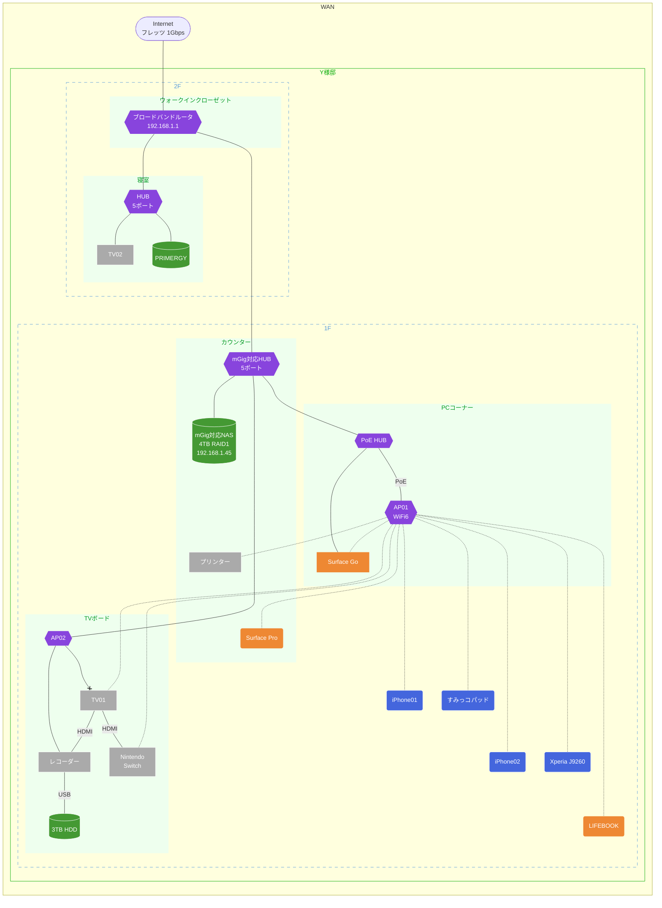

### 導入前課題と対応内容
1. おしゃれなテレワーク環境が欲しい
    * ディスプレー、モニターアームは白で統一
    * 配線カバー付きで見た目もスッキリ
1. Wi-Fiの電波が寝室まで届かない
    * PCコーナーのモニター背面にAPをマグネット設置
    * PoE給電で配線もスッキリ
    * TVボード内のAPはHUBとして再利用
1. ファイルサーバへのアクセスが遅い
    * mGig対応のNASとHUBを導入し、Cat6A配線でパフォーマンスを最大化
    * Wi-Fi6対応APにより高速アクセス
1. ファイルサーバの故障によりデータが損失する
    * NASをRAID1構成とすることで耐障害性を向上

### 部材（税抜定価）
* Wi-Fi6 AP
* PoE HUB
* 2.5Gbps対応NAS
* 2.5Gbps対応HUB
* ディスプレー
* モニターアーム
* マグネットシート
* ブックエンド
* Cat6A LANケーブル
  * 0.3m x 2
  * 0.5m x 1
  * 1.0m x 1
  * 2.0m x 1

### 作業工数（約3時間）
* 機器搬入、開梱：20 min
* モニターアーム、ディスプレー設置：40 min
* NAS、HUB設置：10 min
* PoE HUB、AP設置：10 min
* NAS初期設定：30 min
* AP初期設定：30 min
* 動作確認：20 min
* 後片付け：20 min